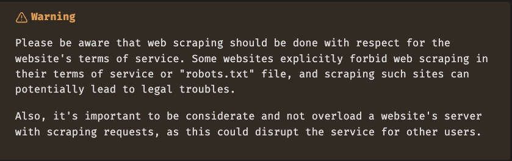

## Web scraping Kata

## Description

Web scraping is a technique used to extract large amounts of data from websites whereby the data is
extracted and saved to a local file in your computer or to a database in a tabular form.
Here is how a typical web scraping process works:

1. A web scraper sends a GET request to the URL that you have instructed it to scrape.
2. The server responds to the request by returning the HTML content of the webpage.
3. The web scraper then parses the HTML content of the page, filters out the data it needs,
   and saves this data into a format you want.

This project illustrates Web scraping challenges and concepts, showing how to:

- Set up a Selenium web scraping project using Spring Boot.
- Set up a web scraping service docker image using _Firefox_ WebDriver and [Spring Boot layered Jar](https://www.baeldung.com/spring-boot-docker-images#layered-jars).
- Set up Selenium standalone docker images using [spring docker compose](https://spring.io/blog/2023/06/21/docker-compose-support-in-spring-boot-3-1), to run scraping jobs which 
  significantly improves the isolation and manageability of web scraping tasks.
- Support multiple browsers.
- Manage WebDriver instances in a multi-threaded environment.
- Implement WebDriver pooling manager using Apache Common pool.
- Implement Page Object Pattern.
- [Retry with Spring Boot and Resilience4j](https://reflectoring.io/retry-with-springboot-resilience4j/)
- How to pass captcha challenge using [Tesseract and Tess4J](https://www.baeldung.com/java-ocr-tesseract)



## Technologies Used

This project uses a number of technologies and libraries:

- **Java JDK 17**: The latest version of Java Development Kit is used for implementing the application logic.

- **Selenium**: A web testing library used to automate browser activities.

- **Spring Boot**: It makes it easy to create stand-alone, production-grade Spring based Applications that you can "just run".

- **Spring MVC**: A Java framework that is used to build web applications. It follows the Model-View-Controller design pattern.

- **Maven**: A software project management and comprehension tool used primarily for Java projects.

- **Docker**: Docker is used to contain and manage the application and its infrastructure.

- **Apache Common pool**: A library providing object-pooling definitions and has several implementations.

- **Chrome / Firefox WebDriver**: Google Chrome / Mozilla Firefox Driver is a WebDriver implementation that enables programs to control 
  Chrome / Firefox browser and use it for testing web applications.

Feel free to explore the project and suggest any improvements.

## Getting Started

### Prerequisites

- Java JDK version 21
- An IDE that supports Java and Spring Boot development, such as IntelliJ IDEA
- Maven
- Docker
- Chrome or Firefox browser, if running locally
- [Tesseract](https://tesseract-ocr.github.io/tessdoc/Installation.html), if running locally

### Installing

1. Clone the repository `git clone git@github.com:ehayik/web-scraping-kata.git`
2. Open the project folder.
3. Run `mvn clean compile` to install the necessary dependencies from the POM file.

### Running locally

1. Run `mvn spring-boot:run -Dspring-boot.run.arguments="--web-driver.browser=chrome"`

> **Note:** 
> spring-boot.run.arguments is used to pass command line arguments to the _Spring Boot_ application. 
> The `--web-driver.browser=chrome` part is the actual argument being passed, where we are setting 
> the `web-driver.browser` property to _chrome_. Please replace chrome with the browser you want the _WebDriver_ to use.
> Supported browsers are, _chrome_ and _firefox_

### Running locally with Selenium standalone docker images

1. Run `mvn spring-boot:run -Dspring-boot.run.profiles=<browser>-remote`

>**Note**:
> Replace `<broswer>` with a supported browser, `chrome` or `firefox`.
> Spring docker compose will deploy a Selenium standalone docker image, ready to use.

### Running container

1. Run `mvn clean package` to package application in jar file.
2. Run `docker build -f <Browser>Dockerfile -t web-scraping-kata:0.0.1 .`  to build your Docker image.
3. Run `docker run -d -p 8080:8080 --name web-scraping-kata  web-scraping-kata:0.0.1` to run it.

>**Note**:
> Replace `<Broswer>` with a supported browser, `Chrome` or `Firefox`.

### Usage

### GET scrapeme-shop/products

Returns products listed in Scrapeme Shop website.

Example request: 

```bash
curl -X GET http://localhost:8080/scrapeme-shop/products
```

Example response:

```json
[
   {
      "url": "https://scrapeme.live/shop/Bulbasaur/",
      "image": "https://scrapeme.live/wp-content/uploads/2018/08/001-350x350.png",
      "name": "Bulbasaur",
      "price": "£63.00"
   }
]
```
### GET  technical-review/{licensePlateNumber}

Returns technical review information for vehicles registered in Bulgaria. 

Example request:

```bash
curl -X GET http://localhost:8080/technical-review/E8066KK
```

Example response:

```json
{
  "licensePlate": "E8066KK",
  "validTo": "2024-11-11"
}
```